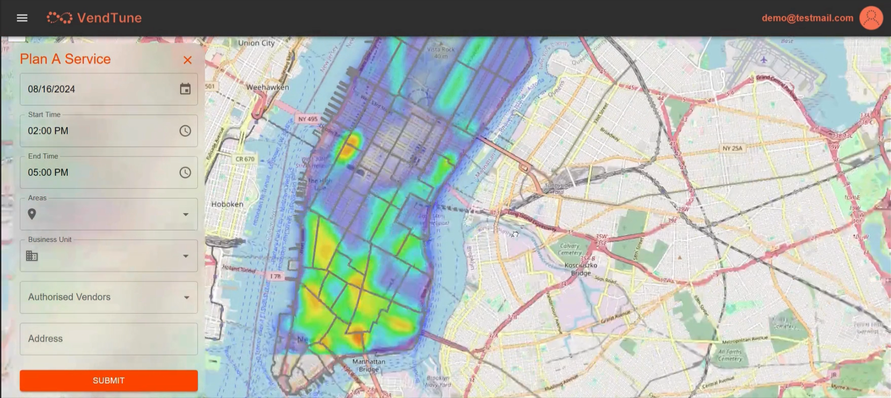
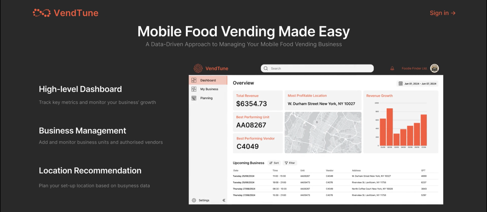
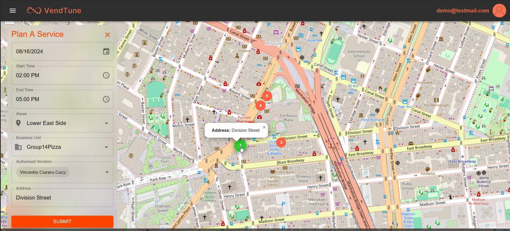
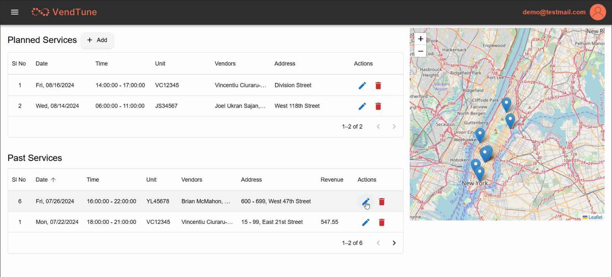
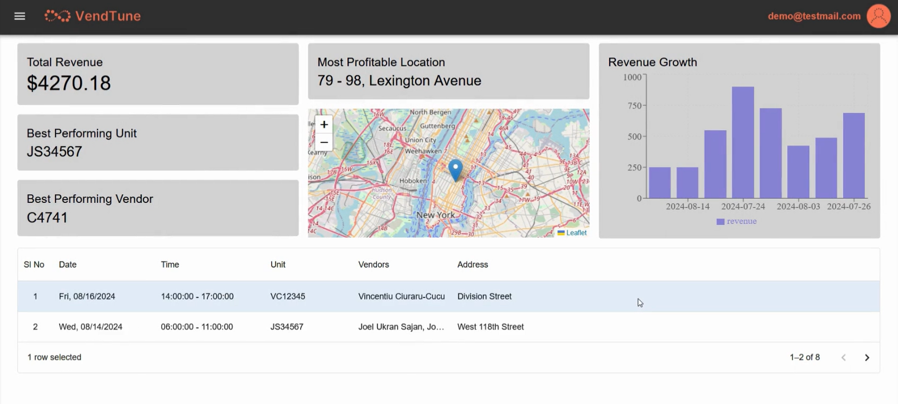

# VENDTUNE

## Overview

The "Intelligent Location Recommendation System for Street Food Vendors in NYC" is a web-based application designed to help street food vendors make informed decisions about optimal vending locations. By leveraging various data sources, including real-time traffic, public transportation usage, and weather conditions, the system provides actionable insights to maximize vendor sales and customer satisfaction.

This project features a robust backend that handles data collection and processing, combined with a user-friendly frontend interface that presents the data in a clear and interactive manner. The entire system is deployed on Microsoft Azure, ensuring reliability and scalability.

## Key Features

- **Responsive UI/UX:** A dynamic and responsive frontend built using React, which includes interactive maps, user dashboards, and editable data grids. This ensures a seamless and engaging experience for users.
- **Data-Driven Backend:** A powerful backend developed with Django and Django REST Framework (DRF), responsible for managing complex data processing tasks and delivering RESTful APIs. This ensures efficient data handling and smooth communication between the frontend and backend.
- **Geospatial Analytics:** Integration of diverse data sources such as NYC taxi traffic, Citi Bike usage, and subway station foot traffic into a PostgreSQL database. This enhances the accuracy of location-based decision-making by providing comprehensive geospatial insights.
- **Forecasting Model:** Implementation of time series forecasting models to predict future foot traffic in various locations. This helps vendors optimize their location choices to maximize sales potential.
- **Cloud Deployment:** The entire application is deployed on Microsoft Azure, ensuring high availability, scalability, and the ability to handle peak traffic efficiently.

## Technologies Used

- **Frontend:** React
- **Backend:** Django, Django REST Framework (DRF)
- **Database:** PostgreSQL
- **Hosting/Deployment:** Microsoft Azure

## System Architecture

### Frontend
The user interface is developed with React, focusing on a responsive and intuitive design. It includes interactive maps with location markers, customizable dashboards, and grids that allow users to interact with data easily.

### Backend
The backend is powered by Django and DRF, which handle data processing, API management, and business logic. It connects to a PostgreSQL database where all the geospatial and transactional data is stored.

### Data Integration
Data is gathered from multiple sources:

1. NYC taxi traffic data
2. Citi Bike usage statistics
3. Subway station foot traffic data
4. Real-time weather data from the OpenWeather API

### Machine Learning
Time series forecasting models are employed to predict future foot traffic trends based on historical data. This allows vendors to make data-driven decisions on where to set up their stalls.

### Cloud Deployment
The application is hosted on Microsoft Azure, utilizing its services for web app hosting, database management, and scaling.

## Overview of Development Tasks

### Backend

1. Create a Python script to make requests with the JCDecaux and OpenWeather APIs to access relevant data (in JSON format). This script will be run at set intervals (5 minutes) to update data available to users.
2. Create a second Python script that contains functions for the creation and modification of a database with the format of data provided by the first script. This second script includes functions to parse the JSON file generated by the first script. The data is then appended to the database.
3. Set up RDS and access with database creation/modification functions.
4. Set up Python scripts (scraper, parser, and database updater) on an AWS EC2 instance. Configure crontab to run scripts at necessary intervals.
5. Host the Python data request script on Flask for use by the frontend.

### Frontend

The frontend of the application is developed using HTML, JavaScript, and CSS. The design features an embedded Google Map for visualizing bike station locations and real-time data overlays. The user interface is tailored for ease of use, offering an intuitive way to view and interact with the data provided by the backend.

## Demo

You can view a demonstration of the application on YouTube : https://www.youtube.com/watch?v=gg7fXJQP8OA.

## Screenshots

